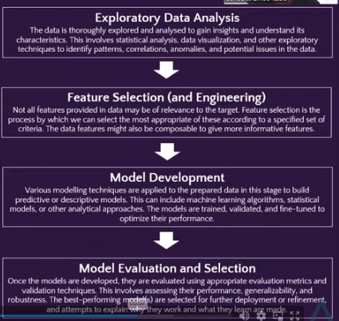

# Cryptocurrency Price Forecasting: Predict Cryptocurrency Market Movements with Precision

To forecast/predict the price of cryptocurrency, to see the future prices by applying machine learning.
Observe the market and be prepared for the twists and turns

This project focused on applying machine learning techniques to forecast cryptocurrency prices, providing valuable insights into market trends and potential future movements. Utilizing Python for the project and its powerful libraries —including NumPy, Pandas, Matplotlib, Seaborn, and Statsmodels — to develop predictive models. 
This  helps  deepened understanding of machine learning applications in financial markets and also enhancing the analysis and interpretation of complex datasets as a guide for the market’s volatile nature.
## Business Focus: Financial Sector
## Learning points
-	Exploratory Data Analysis (EDA)
-	Time series modelling
-	Feature Engineering
-	Model Explainability

## Business Introduction: 
**Quantum Investments** is a well-known quantitative trading firm known for its cutting-edge quantitative trading strategies and data-driven investment decisions.

With a diverse portfolio of assets under managements, the firm has consistently delivered strong returns to its investors. This is only possible due to the expertise of the investment bankers and financial experts.
Having provided sound financial advice and investments to a wide array of customers for the past 30 years, Quantum investments is a household name in the financial sector.
## Business Overview/Problem
-	Business Problem  I
The financial market is expanding at a rapid rate. New financial instruments are being developed with high regularity, and cryptocurrency is one those.
The wave of cryptocurrency is rising at a fast pace, and Quantum Investments intends to position itself to best ride that wave.

-	_Quantum Investments is being steered in the direction best suited to:_

A.  Launch their own crypto tokens and
B.  Take advantage of other crypto tokens to make profit.
 
-	Business Problem II
In order to achieve these goals as fast as possible, the executive team is going to develop a couple means of incorporating technology and automation into their workflow.
This would be beneficial, not only for achieving their business goals, but also relieving their brokers and financial strategists. This would free them up and allow them to operate more effectively at scale, making huge numbers of trades at a time.
You have been chosen to spearhead this effort. Your goal is to come up with a system that can:

A.  Take in historical cryptocurrency data, and
B.  Forecast expected prices (and possibly, market cap and volume) at some future point.
 
-	Business Problem III
To be more specific, the specific challenges of interest to Quantum Investments are:
A.  Volatility & Uncertainty: Cryptocurrency markets are highly volatile. Prices are subject to rapid fluctuations driven by various factors, including news events and social sentiment. A means to adapt to these factors would be appreciated.
 
B.  Risk Management: As a result of market volatility excessive care must be taken by the firm to avoid wiping out their position. This usually results in losing a lot of risky, but profitable trades.
 
C.  Market Modeling: Developing quantitative models that could effectively capture the dynamic factors & nature of cryptocurrency markets can help in understanding the human element that underpins all markets.

## Rationale for the Project: Why Cryptocurrency Price?
Predicting cryptocurrency prices was essential for Quantum Investments to capitalize on market opportunities and manage risks.

More rationale for this project include:

A.	 Market Opportunity: Cryptocurrencies offered the potential for high returns, making accurate price prediction a valuable asset.
 
B.	Diversification: Expanding the firm's portfolio to include cryptocurrencies would enhance diversification and risk mitigation.
 
C.	Client Demand: Investors were increasingly interested in cryptocurrencies, and meeting this demand was essential for retaining and attracting clients.
 
D.	 Competitive Edge: Successful cryptocurrency price prediction would give the firm a competitive edge in the rapidly evolving financial landscape.

## Aim of the Project
The aims of the project are:
A. 	Develop Crypto Price Forecasting Models: Develop advanced quantitative models for cryptocurrency price prediction.
 
B. 	Feature Selection (and Engineering): Identify (and engineer) relevant features that contribute to accurate gas level detection.
 
C. 	Model Understanding: Observe the trained model for understanding of important predictors within the data.

## Data Description:
The requirement for the dataset include:

-	Cryptocurrency name and symbol: Identifiers of the cryptocurrency of interest.
-	Open & Close Prices: Prices at the open and close hours of the trading session.
-	Price Changes: Changes in price over short-term intervals e.g., 1 day.
-	Equivalent Prices: Prices in terms of other standards e.g., USD, Bitcoin (BTC).
-	Market Cap & Volume: The total limits on cryptocoin supply in the market.
The fields recorded in the dataset are:
-	Trade date: Date of trade.
-	Trade Volume: Volume traded.
-	Price (USD): Crypto price in US Dollars
-	Price (BTC): Prices in terms of Bitcoin (BTC).
-	Market Cap: Total value of all coins mined till date
-	Capitalization change: Change in market cap within the past day.
-	Price change (USD): Change in crypto price (US Dollars) within the past day.
-	Price change (BTC): Change in crypto price (Bitcoin) within the past day.
-	Crypto name: Name of cryptotoken.
-	Crypto type: Type of cryptotoken.
-	 Ticker: Symbol of cryptotoken.
-	Max supply: Maximum number of crypto coins that will ever be mined.
-	Crypto type: Type of cryptotoken.
-	Site URL: Website for cryptotoken.
-	Github URL: GitHub repo for cryptotoken.
-	Minable: Mineability status for cryptotoken (0 or 1).
-	Platform name: Platform on which cryptocurrency is designed.
-	Industry name: Type/status of parent cryptocurrency project.
-	
## Tech Stack
The programming language of use, as in most of ML, is Python.
The Python libraries of interest for this project are:
A. 	NumPy: Numerical computation 
B. 	Pandas: Data munging and manipulation
C. 	Matplotlib and Seaborn: Data Visualization
D. 	Statsmodels: Statistical analysis and simple machine learning

## The Below Link is The code showing the analysis, insights and machine learning

[[https://github.com/EngrIBGIT/Cryptocurrency-Price-Forecasting-Predict-Cryptocurrency-Market-Movements-with-Precision/blob/main/cryptocurrency_price_forecasting_with_machine_learning.py](https://github.com/EngrIBGIT/Cryptocurrency-Price-Forecasting-Predict-Cryptocurrency-Market-Movements-with-Precision/blob/main/Cryptocurrency_Price_Forecasting_with_Machine_Learning.ipynb)](https://github.com/EngrIBGIT/Cryptocurrency-Price-Forecasting-Predict-Cryptocurrency-Market-Movements-with-Precision/blob/main/Cryptocurrency_Price_Forecasting_with_Machine_Learning.ipynb)

       
